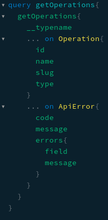

# Crypto Journal Backend

[](https://nodejs.org/it/) [](https://nestjs.com/) [](https://graphql.org/) [](https://firebase.google.com/) [](https://www.mongodb.com/) [](https://www.docker.com/) [](https://www.heroku.com/)

This is the backend of the [Crypto Journal App](https://github.com/xeno097/crypto-journal-mobile), built with [NestJs](https://nestjs.com/), [Graphql](https://graphql.org/) and [MongoDB](https://www.mongodb.com/).

## Project Overview

This project implements all the server-side logic to handle the user data.
Firebase is used to handle user auth, while MongoDB stores the user data. The cryptocurrencies data is retrieved using the [CoinApi](https://www.coinapi.io/). As the project is hosted on Heroku, instead of having a cron-job to update regularly the crypto-currencies data, the project will do it on start-up if it wasn't already updated.
A different approach, inspired by the [Golang](https://go.dev/blog/error-handling-and-go) programming language, is used to handle errors. Instead of throwing errors, functions and methods return a tuple of two elements where the first is the error while the latter is the data itself.

## Tech Stack

The project is built with the following tools:

### Graphql

The API layer is exposed using Graphql. Every resource is exposed as a [Graphql Union](https://graphql.org/learn/schema/) of two types to improve error handling on the client-side. These are:

- ApiError
- The requested resource (User, Operation ...)

If an error were to happen during a request, instead of sending the default graphql error response, the API would respond with a nicely formatted error.



### Nestjs

Is the framework used to develop all the server side logic. Its main advantages are that it is built upon the express framework, it's easy to use, can be easily integrated with third party packages and enforces a good project structure.

### Firebase

The [Firebase Admin SDK](https://firebase.google.com/docs/admin/setup) is used to verify that the tokens received from the client app are valid so that a user can be successfully logged in or registered.

### MongoDB

MongoDB is used to store the data. The [aggregation framework](https://docs.mongodb.com/manual/aggregation/) is used to retrieve the overview and holding data belonging to a user.

### Docker

Docker is used to standardize the project environment and to make it easier to deploy it to Heroku.

## Setup

The project can be run either with docker or with the `npm run start` command. In both cases, the following variables must be provided:

```txt
PORT
NODE_ENV -> optional
DB_URI
ACCESS_TOKEN_SECRET
ACCESS_TOKEN_EXP
REFRESH_TOKEN_SECRET
REFRESH_TOKEN_EXP
GOOGLE_SERVICE_ACCOUNT -> Full google service account json object for firebase
COIN_API_BASE_URL -> Api url without version key
COIN_API_KEY
```

## License

[MIT](./LICENSE)
